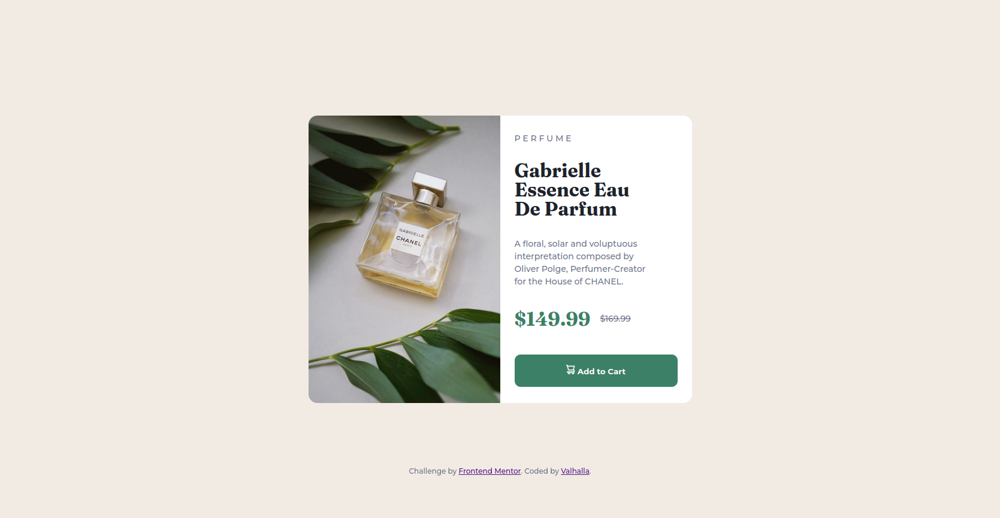

# Frontend Mentor - Product preview card component solution

This is a solution to the [Product preview card component challenge on Frontend Mentor](https://www.frontendmentor.io/challenges/product-preview-card-component-GO7UmttRfa). Frontend Mentor challenges help you improve your coding skills by building realistic projects.

## Table of contents

- [Overview](#overview)
  - [The challenge](#the-challenge)
  - [Screenshot](#screenshot)
  - [Links](#links)
- [My process](#my-process)
  - [Built with](#built-with)
  - [What I learned](#what-i-learned)
- [Author](#author)
- [Acknowledgments](#acknowledgments)

## Overview

### The challenge

Users should be able to:

- View the optimal layout depending on their device's screen size
- See hover and focus states for interactive elements

### Screenshot

### Links

- Solution URL: [solution URL here](https://github.com/Valhalla-2/Product-Preview-Card)
- Live Site URL: [live site URL here](https://valhalla-2.github.io/Product-Preview-Card/)

## My process

### Built with

- Semantic HTML5 markup
- CSS custom properties
- Flexbox

### What I learned

I learned how to make my website responsive on mobile devices

## Author

- Website - [valhalla](https://github.com/Valhalla-2)
- Frontend Mentor - [@Valhalla-2](https://www.frontendmentor.io/profile/Valhalla-2)

**Note: Delete this note and add/remove/edit lines above based on what links you'd like to share.**

## Acknowledgments

Thanks [Kevin Powell](https://www.youtube.com/kepowob) for making [This Video](https://youtu.be/srvUrASNj0s?list=PL6Efx19_XLN9e5BwNvUg62gbNINyabt-_) , without this i won't be able  to complete my responsive design .
